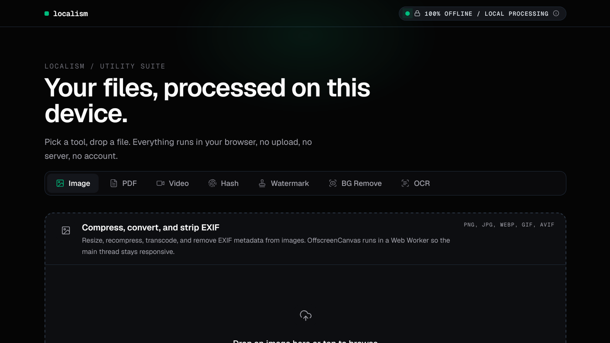

# Localism

**Zero cloud uploads, WebAssembly at the core, fully offline after the first load.**

[» Try Live Demo](https://satirrdev.github.io/localism/) · [Report a Bug](https://github.com/satirrdev/localism/issues)



A privacy-first suite of file utilities that run entirely in your browser. Drop in a file,
get the result back. No account, no upload, no server holding your data.

## Tools

| Tool | What it does | Input |
| --- | --- | --- |
| **Image Compression** | Resize, recompress, transcode, and strip EXIF/GPS via OffscreenCanvas in a Web Worker | PNG, JPG, WebP, GIF, AVIF |
| **PDF Studio** | Merge, split, sign, and redact (fail-closed full-page blackout) with pdf-lib | PDF |
| **Video Transcoding** | Compress, transcode, and extract audio with FFmpeg WASM in a Web Worker | MP4, WebM, GIF, MP3 |
| **Hash Verification** | SHA-256, SHA-1, SHA-512, and MD5 computed from a streamed 8 MB-chunked read | Any file, any size |
| **Watermark & Redaction** | Stamp IDs, KTP, passports, and invoices, or censor sensitive fields on Canvas | JPG, PNG, WebP |
| **BG Remove** | ONNX background removal running fully in-browser | JPG, PNG, WebP |
| **Local Offline OCR** | Extract text with a vendored Tesseract SIMD WASM core (English + Indonesian) | JPG, PNG, WebP, BMP |

## Architecture & Privacy

- **Zero network transit** — files are read from disk straight into browser memory and processed locally. No upload, no API, no telemetry. The only requests the app ever makes are same-origin fetches for its own vendored WASM cores and models.
- **Memory sandboxing** — no server-side storage exists to leak. Data lives in the tab's own memory; every object URL is revoked and every worker terminated on completion or unmount.
- **Web Workers** — image transforms, hashing, PDF work, FFmpeg, and Tesseract all run off the main thread, so the UI stays responsive under heavy loads.
- **Vendored WebAssembly** — FFmpeg, Tesseract, and ONNX models are committed to the repo and served from your own origin. No CDN, no third-party runtime fetches.
- **Streaming digests** — SHA-256/1/512 and MD5 use incremental pure-JS implementations (js-sha\*, SparkMD5) so multi-gigabyte files hash without loading fully into memory.
- **Offline by construction** — WASM cores and OCR language models are stored in the Cache Storage API, so repeat visits keep working with the network switched off.
- **Hardened headers** — when self-hosted, the app sets COOP/COEP, `nosniff`, `no-referrer`, and `X-Frame-Options: DENY` (see the deployment note below).

## Tech Stack

- **Next.js 16** (App Router, static export)
- **React 19**
- **TypeScript 5**
- **Tailwind CSS v4** with custom OKLCH design tokens
- **Web Workers** for off-main-thread processing
- **WebAssembly** — FFmpeg, Tesseract SIMD, ONNX
- **pdf-lib**, **Lucide React**

## Getting Started

```bash
git clone https://github.com/satirrdev/localism.git
cd localism
npm install
npm run dev
```

Open [http://localhost:3000](http://localhost:3000).

To produce the deployable site, run `npm run build` (emits a static `out/` directory) and
preview it locally with `npm start`.

## Deployment

Pushing to `main` runs the full gate in GitHub Actions — lint, static build, and
`npm audit` — then publishes `out/` to GitHub Pages. Because Pages serves the app from a
sub-path, the build injects `NEXT_PUBLIC_BASE_PATH=/localism` and all client-side asset
URLs (workers, WASM, models) resolve under that prefix.

One caveat worth knowing: GitHub Pages cannot set HTTP response headers, so the COOP/COEP
and hardening headers declared in `next.config.ts` only apply when you deploy to a host
that supports them (e.g. Vercel or a proxy in front of Pages). The app is designed so
this does not affect functionality — it ships single-threaded WASM builds and loads zero
third-party subresources — but if header hardening is a hard requirement, front the
Pages deployment with a proxy that can set them.

## License

[AGPL-3.0](LICENSE), GNU Affero General Public License v3.0
